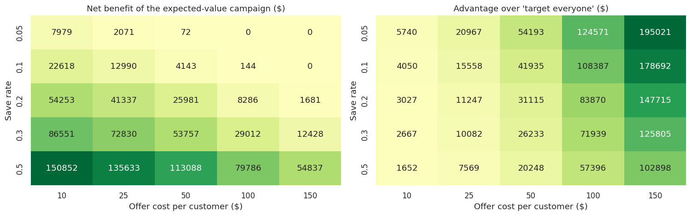
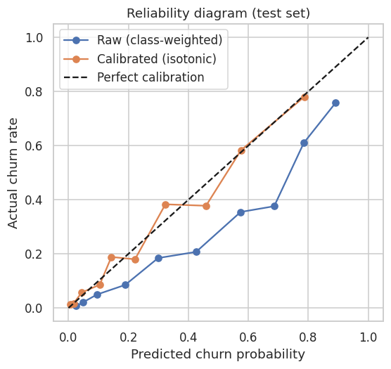
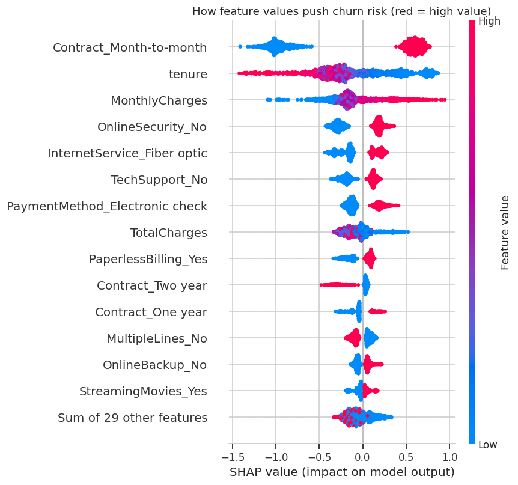

# Customer Churn Prediction & Retention Targeting

End-to-end churn analysis on the IBM Telco dataset (7,043 customers): EDA, leakage-safe modelling, calibrated probabilities, SHAP explanations, and a cost-benefit simulation that turns predictions into a retention-campaign decision rule. Includes an interactive Streamlit app.

**Live demo:** <!-- add your Streamlit link, e.g. https://your-app.streamlit.app -->

<!-- Add an app screenshot here: save it as docs/app_screenshot.png and use  -->

## Key results (held-out test set, 1,409 customers)

| Model | ROC-AUC | PR-AUC |
|---|---|---|
| Logistic Regression | 0.842 | 0.632 |
| Random Forest | 0.840 | 0.649 |
| **XGBoost (tuned)** | **0.846** | **0.665** |

All three models perform similarly, which is common on this dataset. XGBoost is used for the app, but the simple logistic regression baseline is a legitimate choice if interpretability matters most.

- **Calibration:** isotonic calibration lowered the Brier score from 0.161 to 0.135, and brought the mean predicted churn from 40.2% (class-weighted raw scores) to 26.7% against an actual 26.5%. Ranking quality was unchanged (ROC-AUC 0.846).
- **Churn drivers (SHAP):** month-to-month contract, short tenure, high monthly charges, no online security, and fiber optic service. In the data, churn is 42.7% on month-to-month contracts vs 2.8% on two-year contracts, and 52.9% in the first 6 months of tenure vs 9.5% after 4 years.
- **Targeting:** contacting the 20% riskiest customers reaches 51% of all churners (2.6x lift over random).

### Simulated retention campaign

Assumptions (illustrative, editable): $25 per offer, 30% of would-be churners saved, 12 months of revenue preserved.

| Strategy | Customers contacted | Churners reached | Net benefit |
|---|---|---|---|
| Do nothing | 0 | 0 | $0 |
| Contact everyone | 1,409 | 374 (100%) | $62,749 |
| Raw score >= tuned threshold | 942 | 357 (95.5%) | $70,889 |
| **Calibrated expected-value rule** | **842** | **342 (91.4%)** | **$72,830** |

The expected-value rule contacts customer *i* only if `P(churn) × save rate × revenue at risk > offer cost`. With these assumptions even contacting everyone is profitable (break-even save rate 10.8%), so the model's edge is modest at a $25 offer. Across the sensitivity grid it never lost money and always beat contacting everyone, and the advantage grows as offers get more expensive or save rates fall.



| | |
|---|---|
|  |  |

## Repository contents

| File | Purpose |
|---|---|
| `churn_prediction_analysis.ipynb` | Full analysis: EDA, modelling, tuning, SHAP, calibration, cost analysis (outputs included) |
| `app.py` | Streamlit app: calibrated probability, expected-value decision, SHAP reasons, retention actions |
| `churn_model.joblib` | Saved tuned pipeline + calibrated model + business parameters |
| `requirements.txt` | App dependencies |
| `docs/` | Figures used in this README |

## Run locally

```bash
pip install -r requirements.txt
python -m streamlit run app.py
```

To re-run the notebook: `pip install -r requirements.txt seaborn jupyter`, then open `churn_prediction_analysis.ipynb`. The dataset is downloaded automatically (fallback: place `Telco-Customer-Churn.csv` next to the notebook). Running the notebook regenerates `churn_model.joblib` for your library versions.

Requires Python 3.11+ (the pinned scikit-learn 1.8.0). If you hit an unpickling or version error, re-run the notebook and replace `churn_model.joblib`.

## Method highlights

- Row-wise feature engineering and sklearn `Pipeline`s, so scaling and encoding are fitted on training folds only (no leakage).
- Class imbalance handled with class weights rather than resampling.
- 5-fold stratified CV for model comparison; XGBoost tuned with randomized search on PR-AUC.
- Decision threshold and calibration fitted on training data only; the test set is used once for the final check.

## Limitations and next steps

- The business assumptions are illustrative. Real values should come from A/B tests and finance data; the app lets you change them.
- Predictions show association, not causation. Validating retention offers needs a controlled experiment, with uplift modelling as the natural next step.
- The dataset is a single snapshot with no dates, so no temporal validation or drift monitoring was possible.
- Calibration should be re-checked periodically after deployment.

## Data

IBM Telco Customer Churn sample dataset.
